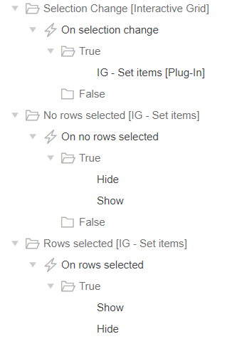

# orclapex-ig-set-items
This plug-in lets you bind APEX page items to Interactive Grid columns and vice-versa. A good way to use advanced IG features declaratively.

## Demo
https://apex.oracle.com/pls/apex/f?p=115922:6

## Blog
http://menn.ooo/plug-in-ig-set-items

## Features
* Set primary key values or other columns based on selected row(s)
* Two way data binding between columns and page items
* Multiselection (update multiple rows at the same time)
* Set grid selection at page load based on item values
* Disable page items for deleted rows or readonly columns

## Settings
These are the events and actions for the demo application:

And below the attribute settings. You can also find an explanation in the help section of the plugin.

Explanation of the attributes.

| Attribute | Purpose |
| --- | --- |
| Primary Key Page Item(s) | Works when you specify IG columns as primary key. Here you assign those column(s) to page items. No need to specify the primary key columns, these should be set in the Interactive Grid attributes. Do take care of the page item order of this attributes, it must be the same as the PK column order. |
| Column(s) | A comma separated list of columns of which the values will be set into page items. These should be non-primary key columns. |
| Page Item(s) | A comma separated list of page items of which the column values will be set to. These should be non-primary key page items. Specify them in the same order as the columns. |
| Remember active row | Selects rows at page load by using the Primary Key Page Item(s). Useful in master-detail scenarios. |
| Disable items for non-editable IG | If you use this plugin for readonly purposes only it will disable all the assigned page items. |

## Events
| event | Purpose |
| --- | --- |
| Rows selected | Execute something (hide/show region) when at least a single row is selected |
| No rows selected | Execute something (hide/show region) when no rows are selected |

## IG Cookbook
The IG Cookbook application was used as an inspiration for this plugin. The Cookbook application is developed and maintained by John Snyders. You can find the latest version here:  
http://hardlikesoftware.com/weblog/2018/01/01/apex-ig-cookbook-for-5-1-4/

## Future developments
Please provide feedback in the issues section of this GitHub projects of your requests and bugs.

